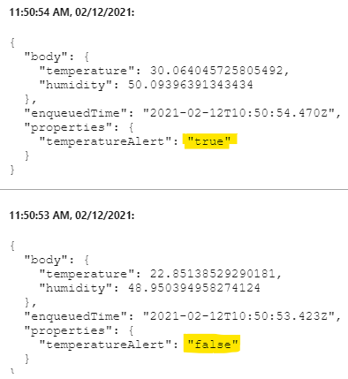
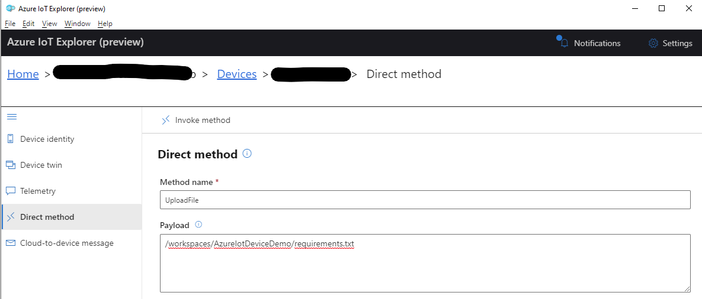

# Introduction
This sample creates a simulated IoT device (in Python) and offers
- Connect to IoT Hub with a ConnectionString, or use Device Provisioning Service (DPS) to register itself first
- Sending Telemetry to IoT Hub
- Set an alert when the temperature rises above 30°C
- Allows changing the sending interval via direct method call
- Upload a file to Azure Blob Storage, triggered by another direct method call
- Change the content of a local file

The sample also includes a devcontainer configuration, which means you can open it in a docker environment without installing requirements locally.

## IoT Hub or Device Provisioning Service?
To use the IoT Hub connection, simply set the ```CONNECTION_STRING```. Leave it empty and fill ```DPS_ID_SCOPE```, ```DPS_REGISTRATION_ID```, ```DPS_REGISTRATION_KEY``` with your values.

## Sending Telemetry
Once started, simulated temperature and humidity values will be sent as json to the IoT Hub. ```{"temperature": 21.104686502050246,"humidity": 63.3718109522079}```. The default interval is 1 second. This can be adjusted via direct Method call on ```SetTelemetryInterval``` with just a number (in seconds) in the payload.

## Temperature Alert
In case the temperature exceeds 30°C, an alert is set to true.


This property can be used to e.g. route messages in IoT Hub to a different endpoint.

## File Upload
A local file can be uploaded to an Azure Blob Storage account with another direct method call.



## Change local file content
The use case for this demo is to change the values of a configuration file on the IoT device via IoT Hub.
The **config.json** file in this repository contains ```{"color": "yellow", "size": "L"}```.

With a direct method call to ```ChangeParameter``` and a payload of ```{"color":"green"}``` the color in the local file will be set to green.

## Run the sample
Set the connection string variable in IotDevice.py ```CONNECTION_STRING = ""``` to a connection string of a previously created IoT Device in an IoT Hub.

## Links
- [Getting Started with Python 3 Dev Containers](https://medium.com/@dexterwilliams04/getting-started-with-python-3-dev-containers-4f14821fec6b)
- [Derive a symmetric key for DPS](https://docs.microsoft.com/en-us/azure/iot-edge/how-to-auto-provision-symmetric-keys?view=iotedge-2018-06#derive-a-device-key)
- [Upload files from your device to the cloud with IoT Hub (Python)](https://docs.microsoft.com/en-us/azure/iot-hub/iot-hub-python-python-file-upload)
- [Azure IoT Explorer (preview)](https://github.com/Azure/azure-iot-explorer/releases)