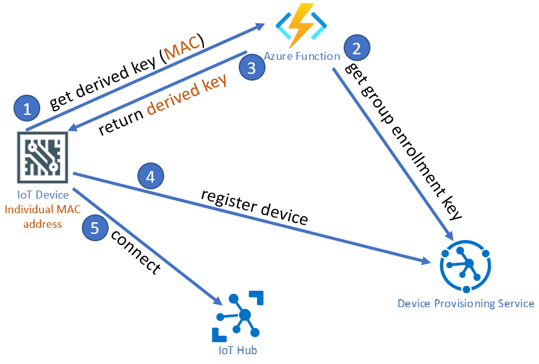

# Introduction
This sample code of an Azure Function will take a registration id, and use the primary key of a group enrollment in Azure Device Provisioning Service to derive a key, that can then be used to connect a device to the enrollment group.

    Ideally the device keys are derived and installed in the factory. This method guarantees the group key is never included in any software deployed to the device.

Well, this is not always possible. The Azure Function is a way to create a derived key later, without the need to place the DPS key on the device(s). You can pass a custom value as device id (e.g. the MAC address) and the Function will return a derived key that you can use to register the device in DPS in the next step.



## Configuration
Two environment variables are used:
- DpsConnectionString
- DpsEnrollmentGroupName

## Usage
After deployment, the function can be triggered with GET or POST. Just pass the function key and an individual id as ```deviceid``` parameter.

The function will return the derived key for the deviceid in the body.

## Links
- [DPS - Group Enrollments](https://docs.microsoft.com/en-us/azure/iot-dps/concepts-symmetric-key-attestation#group-enrollments)
- [DPS - Derive a device key](https://docs.microsoft.com/en-us/azure/iot-edge/how-to-auto-provision-symmetric-keys?view=iotedge-2018-06#derive-a-device-key)
- [Developing inside a container](https://code.visualstudio.com/docs/remote/containers)