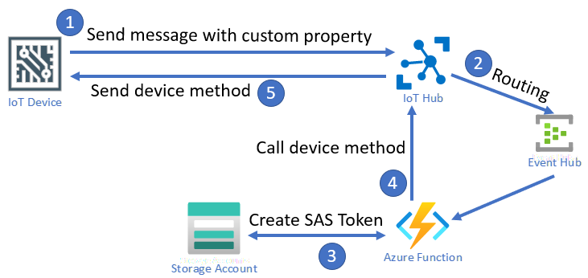

# Introduction
This demo is to show a way for an IoT device to trigger functionality in Azure, and receive back the result.



## Flow
1. A device needs to trigger Azure functionality. For this, the device is sending a plain message to Azure IoT Hub
    - the sample IoT device contains a method that will trigger this process. Just call the method ```TriggerDeviceToCloudServiceRequest```
2. The message will be routed (based on message properties or body) to an Event Hub (an Event Hub is needed to be able to trigger a Function via message routing)
3. The Azure Function is triggered
    - a SAS token is generated
    - A method call (it will be executed synchronously) is triggered on the IoT Hub to pass the SAS token to the device. The method that will be called in the sample device is ```TriggerDeviceToCloudServiceResponse``` and it just returns as response what has been passed to it.

## Links
- [Grant limited access to Azure Storage resources using shared access signatures (SAS)](https://docs.microsoft.com/en-us/azure/storage/common/storage-sas-overview)
- [SDK Sample - SAS Token](https://github.com/Azure/azure-sdk-for-python/blob/azure-storage-blob_12.8.0/sdk/storage/azure-storage-blob/samples/blob_samples_containers_async.py)
- [Blob SAS Token generator Function](https://github.com/yokawasa/azure-functions-python-samples/tree/master/v2functions/http-trigger-blob-sas-token)
- [Azure IoT Python SDK - Invoke command](https://github.com/Azure/azure-iot-sdk-python/blob/master/azure-iot-hub/samples/invoke_command_sample.py)